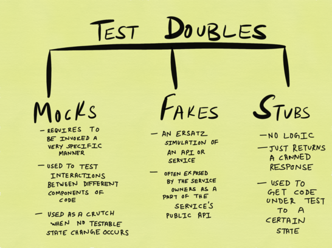
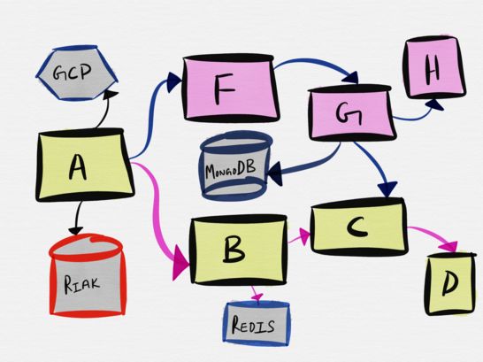

# 以理智的方式的方式测试微服务

关于如何最好地测试软件的信息、最佳实践方式或相关书籍其实并不缺乏。然而，本文只关注于测试后端“服务”，而不是桌面软件或安全关键系统、GUI工具或前端应用程序等。

分布式系统对不同的人有不同的意义

对于本文的目的，我所提到的“分布式系统”是指由许多活动部件组成的系统，每个部件都有不同的保证和故障模式，它们一起协同工作以提供业务特性。

这当然与“分布式系统”的规范定义不太接近，但我认为这些是绝大多数人构建、运行和使用的系统。尽管我们讨论的是分布式系统，但是术语“微服务体系结构”是仍然存在。

## 微服务的主要动力

独立开发，部署和扩展不同业务功能的能力是使用微服务架构最大的优势之一。

虽然目前还没有定论这些好处是否真的实现，但是微服务非常流行，以至于这种体系结构现在已经成为许多新公司的默认架构。

然而，当涉及到测试（或是更糟糕的，开发时）微服务时，大多数组织似乎都更倾向于使用旧式模型来测试所有组件。精心设计的测试管道基础设施是必需的，用以实现端到端的测试形式，其中执行每个服务的测试套件用以确认没有引入任何回归或破坏更改。

（图译1：David Barsky：不了,谢谢。我越来越确信，在微服务环境中进行大规模的集成测试，在一定程度上是站不住脚的，因为您投入的集成测试工作量远大于收到的回报的价值）

（图译2：Cindy Sridharan：是的！微服务的关键是使团队能够独立开发、部署和扩展。然而，在测试方面，我们坚持通过在相同的环境运行来测试所有的东西，这与我们为什么要做微服务的主要问题相矛盾。）

## 一个警示故事——盒子中的全栈

我经常看到或听到很多公司试图在本地的开发者笔记本电脑上复制整个服务拓扑。

在我之前工作的一家公司里，我有过这种谬论的第一手经验，我们曾试图把所有的栈堆在一个Vagrant box里。Vagrant repo本身就被称为“盒子中的全栈”，正如您可能想象的那样，一个简单的`vagrant up`应该让公司的任何工程师（甚至是前端和移动开发人员）都能够在他们的笔记本电脑上*完全*旋转堆栈。

准确地说，这甚至不是一个由数千个服务组成的完整的[Amazon-esque微服务体系结构](https://twitter.com/Werner/status/741673514567143424)。

我们在后端有*两个*服务 - 一个基于[gevent](http://www.gevent.org/)的API服务器和一些异步的Python后台工作者，它们有很多粗糙的本机依赖项，包括[C ++ boost](http://www.boost.org/)库，如果我没记错的话，它是从头开始编译的，并且每次的编译都会导致一个Vagrant box出现。

我记得在这家公司工作的整个第一周，都试图在本地成功地启动VM，但结果却只是遇到了大量的错误。。

最后，在第一周的星期五下午4点左右，我成功地的将使Vagrant成功的运行并可以实现所有测试都在本地传递。我记得最重要的是，在经历了这些繁琐的工作之后，我感到难以置信的疲惫，于是我决定把遇到的问题记录下来，以便我们聘请的下一位工程师能更容易地处理这个问题。

除此之外，下一位工程师遇到了在Vagrant 的设置上属于自己的问题：我个人无法在我的笔记本电脑上进行本地复制。

事实上，我的笔记本电脑上的整个设置非常*脆弱*，甚至担心升级Python会不会会导致问题的出现，因为运行`pip install`会破坏了我的Vagrant设置并导致测试在本地失败。

事实证明，任何网络或移动团队的其他工程师都没有在Vagrant设置上取得多大成功，并且对Vagrant问题进行故障排除也成为了我所在团队的成员需要帮助的常见问题。

虽然有人可能会说，我们应该花更多的工程周期来一劳永逸地将Vagrant问题解决，以便它“正常工作”，但我们要为自己辩护的是，在初创企业中的工程周期“总是”很紧迫的。

[FredHébert](https://ferd.ca/)对这篇文章留下了令人难以置信的深思熟虑的评论，他所做的一个观察让我感到非常震惊，我在这里分享它：

> ...要求在开发机器上启动云相当于成为多基板，支持多个云提供商，其中最糟糕的一个是你见过的（在一台笔记本电脑上配置）

即使采用现代操作最佳实践（如基础架构代码和不可变基础架构），尝试在本地复制云环境也无法提供与实现和于在随后维护它所需的工作相称的优势。

## 构建和测试微服务，整体风格

在和朋友们交谈之后，我才意识到，这个问题不仅困扰着初创企业，也同样的困扰着很多大型企业。

在过去的几年中，我听到了足够的轶事证据，证明这种设置的固有脆弱性以及支持这一设置所需的维修费用，我现在认为试图在开发者笔记本电脑上完全堆叠起来，从根本上来说这种心态首先是错误的，无论是在创业公司还是在大公司。

事实上，这样做等同是构建了一个分布式的整体。

、

（图译：Kelsey Hightower：预测:2020年当人们发现分布式应用程序的缺点后，独立应用将重新流行起来。）

正如[著名博客](http://bravenewgeek.com/) [Tyler Treat](https://twitter.com/tyler_treat)所说：

> [在这个关于HN的微服务讨论中。](https://twitter.com/tyler_treat/status/846100896228544514)“开发人员应该能够在本地运行整个环境。任何别的东西都只是标志着这个工具很糟糕 。“好的，请告诉我在你的macbook上运行24种不同的dbs和依赖项服务的效果如何。如果你执行了以上步骤，我确信你会烦透docker的构成。
>
> 这太常见了。
>
> 人们开始用单一的思维方式构建微服务，结果总是一败涂地。。“我需要使用这种特定的服务配置在我的机器上运行所有内容来测试这一变化。”jfc。
>
> 如果有人连我的服务都打个喷嚏，那就太可恶了。这一方面只能看上帝摇骰。
>
> 此外，跨越众多服务的大规模集成测试是一种反模式，但它似乎仍然是一场令人信服的艰难战斗。转向微服务还意味着使用正确的工具和技术。请停止在新的环境中使用旧技术。
>
> 

作为这个职业的从业人员，我们有责任测试在一个与我们现在所处的时代截然不同的时代发明的方法。人们似乎仍然迷恋于诸如完整的测试*覆盖范围之类的*想法（以至于在某些公司，如果一个补丁或一个新特性分支最终略微减少了代码库的测试覆盖率，合并就会被阻止），[TEST驱动的开发](https://en.wikipedia.org/wiki/Test-driven_development)并在系统级完成端到端测试。

为实现这些目标，这类公司最终投入了过多的工程资源来构建复杂的CI管道和错综复杂的本地开发环境。很快，维持这种精心设置最终需要一个团队自己构建，维护，排除故障并发展基础设施。[较大的](https://medium.com/netflix-techblog/towards-true-continuous-integration-distributed-repositories-and-dependencies-2a2e3108c051) [公司](https://engineeringblog.yelp.com/2017/04/how-yelp-runs-millions-of-tests-every-day.html) [可以承受这种复杂程度](https://medium.com/netflix-techblog/product-integration-testing-at-the-speed-of-netflix-72e4117734a7)，但对于我们其他人来说，将测试视为实际情况 - 系统的最佳努力验证 - 并根据我们的需求进行明智的押注和权衡似乎是最好的前进方式。

## 测试范围

从历史上看，测试是生产前或发布前的活动。一些公司持续雇佣由测试人员或QA工程师组成的专门团队，此类团队的唯一职责是为开发团队构建的软件执行手工或自动化测试。一旦一个软件通过QA，它就被移交给运营团队来运行(对于服务类事务来说)，或者作为一个产品发布发布(对于桌面软件或游戏以及你所有的其他东西)。

（此行以前翻译 by @Bucky Barenes）

这种模式虽然缓慢，但肯定在被逐步淘汰（至少就服务业而言，从我在旧金山初创的企业来说）。开发团队现在正负责测试和操作他们所创作的服务内容。我发现这个新模式非常强大，因为它真正允许开发团队以现实和可持续的方式思考整个测试的范围，目标，权衡和回报。为了能够制定一个整体的战略来理解我们的服务如何运行，并获得对其正确性的信心，考虑到服务的可用性、可靠性和正确性要求，能够挑选整理出正确的测试技术变得极为重要。

总的来说,“测试”可以用来涵盖各种活动，包括许多传统上属于“release	engineering”或“Operations”或QA范围的实践。下图中列出的一些技术，并没有严格地被视为某些领域的测试形式——例如，例如，混沌工程的官方定义中将其分类为一种实验形式。我自己也不认为这个列表很全面，例如安全测试（漏洞测试、渗透测试、威胁建模等）根本就没有在任何地方出现，但它包含了一些天然的最常见的测试形式。

我必须在这里强调，虽然上面的插图将测试分类法分为二种类别表示，但现实并不像这里描述的那样清晰易懂。例如，Profiling
（资料收集）属于“Testing In Production”（生产中测试）列，但它可以很好地在开发期间完成，在这种情况下，它成为Pre-Production Testing（预生产测试）的一种形式。类似地，Shadowing（阴影技术）是一种将少量生产流量与少量测试实例进行重放的技术，根据您的查看方式，它可能符合“Testing In Production”（因为它涉及使用生产流量测试服务）或Pre-Production Testing的形式（因为最终用户不会受到其影响）。

编程语言也为测试生产中的应用程序提供了不同程度的支持。如果您是Erlangista，那么您可能熟悉Fred	Hébert的《在生产系统运行时使用Erlang VM原语调试生产系统手册》。Go之类的语言附带内置支持，用于获取任何正在运行的Go进程（在生产中测试）的堆、互斥体、CPU和Goroutine配置文件，或者在运行单元测试时（这将被限定为生产前测试）。

## 生产中测试（Testing in Production）将成为预生产测试（Pre-Production testing）的替代品吗?

我曾写过一篇从主要的可观察性角度详细描述“生产后测试”的论文[《Monitoring in the time of Cloud Native》](https://medium.com/@copyconstruct/monitoring-in-the-time-of-cloud-native-c87c7a5bfa3e)。监测（Monitoring）是生产后测试（post-production	testing）的一种形式，就像警报、探索和动态仪器一样。它甚至可能没有延伸到将特征标记和门控等技术称为生产中的测试形式。用户交互或用户体验测量通常使用A/B测试和[实际用户监测](https://en.wikipedia.org/wiki/Real_user_monitoring) 等技术执行，也可以被解释为生产中测试的一种形式。

关于这种形式的测试如何可能取代生产前的测试，有些人在某些圈子里争论不休。[Sarah Mei](https://twitter.com/sarahmei) 前一段时间曾对此进行了一次[发人深省的讨论](https://twitter.com/sarahmei/status/868928631157870592)。这里有很多东西要整理，虽然我不同意Sarah的观点，但确实有很多东西需要我去了解。Sarah接着说：

> 传统的观点认为，在发布代码之前，您需要一套全面的回归测试才能通过。 你想知道你的改变并没有破坏应用程序的其他地方。但除了回归套件，还有其他的方法可以分辨。尤其是随着更加复杂的监控和你对操作方面错误率（vs正常运行时间）的更好理解的提高。
> 有了足够先进的监控和足够的规模，编写代码、推动它运行和观察错误率是一个现实的策略。如果应用程序的另一部分发生故障，很快就会在错误率中显示出来。你可以修复或撤销。基本上是让你的监控系统扮演回归套件和持续集成在其他团队中所扮演的角色。

很多人认为这意味着根本不需要进行生产前测试，这不是我所要表述的。从字里行间解读，我猜想，许多软件开发人员（和专业软件测试人员）很难接受这样一个事实， 即单是手工或自动化的预生产测试可能还不够，有时甚至是完全不够的。从软件测试中学到的书中有一章叫做自动回归测试（Automated	Testing），并且作者称，只有少数软件测试是自动回归测试。

 [**Lessons Learned in Software Testing**](https://www.amazon.com/Lessons-Learned-Software-Testing-Context-Driven/dp/0471081124) 一书中有一章叫做自动回归测试，作者声称自动回归测试（Automated	Testing）只发现了其中的一小部分错误。

> 非正式的调查显示，自动测试发现的错误百分比低得惊人。某个重要的、精心设计的自动化工作的项目报告说，回归测试发现大约15%的bug被报告（Marick，online）。
> 回归测试（Regression-test）自动机通常在测试开发过程中发现的bug，比以后执行测试时发现的要多。但是，如果你进行了回归测试，并找到了在不同环境（例如不同的硬件平台或不同的软件驱动程序）中重用这些测试的机会，那么你的测试就更有可能发现问题。实际上，它们不再是回归测试，因为它们是测试以前没有测试过的配置。测试人员报告说，这类自动化测试可以产生接近30-80%的产量。

这本书确实有点过时了，我还没有发现最近关于回归测试的有效性的研究，但是我们所使用的许多运行良好的软件工程实践和学科的训练证明，对于许多人来说，对自动化测试的重要性的任何形式的怀疑都是不合法的。如果我在过去几年见证的失败中学到了什么，那就是预生产测试是对系统一小部分保证的最佳验证，对于具有千变万化的流量模式的长时间运行的系统来说，这是远远不够的。
我们继续Sarah的观点:

> 这个策略假设了很多事情，从大多数开发团队所不具备的复杂的操作开始。更多的是，它假定能够对用户进行分段，将每个开发人员正在进行的更改显示到不同的分段，并为每个分段分配错误率。它假设一个段的错误率的变化在统计学上是显著的。**也许最不寻常的是，它假设了一个产品组织在实时流量的测试中是舒适的**。同样，如果他们已经在实时流量上对产品变更进行了A/B测试，这只是将这个想法扩展到了开发人员的变更上。但是如果你能让它工作起来，那么获得关于你刚刚所做的变更的实时反馈是令人惊奇的。

我的重点是，在我看来，这是对我们建立的系统获得更多信心的最大障碍。总的来说，采用更全面的检测方法的最大障碍是思维方式的必要转变。预生产测试（Pre-production testing）是软件工程师从职业生涯开始就根深蒂固的东西，而实况流量测试的想法要么被视为运营工程师的专利，要么被视为警报和（或）疑虑。

我们习惯于坚持生产（production）是神圣不可侵犯的，并且不被玩弄，即使这意味着我们只会在最好的环境中验证，对真正的作品（production）进行简单的模仿。在尽可能保持与制作“相同”的环境中进行验证，类似于彩排；虽然这确实有一些好处，但与在一个满座的剧场上表演不同。

事实上，对Sarah观点的许多回应都证实了这一点。Sarah回应说，

> 所以这条线索开始时，我提到的其实都是很好的。最有趣的是“但是你的用户会看到更多的错误！”那个声明中有许多微妙的误解。我们看看能不能把它描述清楚一点。将回归责任从测试转移到生产监控，很可能意味着用户将产生更多的错误。因此，如果不修改代码库，**就无法做到这一点**，这样用户就不会注意错误（和减少对错误的影响）。这实际上是一个很好的积极的设计压力，可以在总体上极大地改善你的用户经验。对我来说，有些人的所作所为真的很有趣。“用户产生更多的错误” -> “用户看到更多的错误” -> “你不关心你的用户！”这条推理链中的每一个环节都很薄弱。

（此行以前翻译 by @Whisper-Wang）

这恰到好处的是将回归测试推送到后期生产监控不仅需要思维模式的改变和对风险的一定要求，更重要的是需要对系统设计进行全面检查，同时对良好的发布工程实践和工具进行大量投资。换句话说，它不仅涉及构建失败，实质上是对默认编码成功时编码失败。我敢打赌，这是一个全新的概念，而大量开发人员对此并不太满意。

## 在生产中测试什么,在生产前测试什么?

------

由于服务测试是一种频谱，因此在系统设计（体系架构和代码）时，两种测试形式都是主要考虑因素，因为它打开系统的能力决定系统的哪些功能绝对必须在预生产中得到验证的能力以及哪些特征（更像是特长的特性）更适合在生产中借助更全面的仪器和工具进行探索。

至于边界在哪里以及什么功能正好落在频谱上的哪个位置，只有开发和运营团队可以决定，并且重申，它应该是系统设计的一部分。到目前为止，通过将其视为事后考虑而进行测试或监控的“自上而下”方法已被证明无效。
[Charity Majors](https://twitter.com/mipsytipsy)今年[在Strangeloop公司发表了演讲](https://www.youtube.com/watch?v=1wjovFSCGhE),她谈到了观察和"监视"之间的区别实际上归结为已知的未知数和未知的未知数的关系。

来自Majors在Strangeloop公司2017的谈话

慈善是对的 - 这些并不是你理想的“监控”。同样，这些也不是你想要“测试”前期制作的东西。分布式系统在病理上是不可预测的，并且不可能设想系统的各个部分最终可能会陷入组合的泥潭的数量。我们越早意识到这样一个事实：尝试预测服务可能的每种可能方式都是愚蠢的。为了它而行使并写一个回归测试用例，我们越早采用一种不那么功能失调的测试方法。正如弗雷德·赫伯特在对这篇文章的评论中指出的那样：

> ...随着涉及许多计算机的大型服务的增长，系统在100％健康的情况下不会运行的可能性越来越大。在某个地方总会有失败。如果测试要求100％健康运行，您就知道自己遇到了问题。

在过去,我认为"监视一切"是一种反模式。我觉得同样的理念也可以扩展到测试。一个人根本不能 - 也不应该尝试 - 测试一切。[SRE一书](https://landing.google.com/sre/book/index.html)指出:

> 事实证明，超过某一点，提高可靠性对服务(及其用户)来说不是好事,而是坏事!极高的可靠性需要付出代价：最大化稳定性限制了新功能的开发速度以及产品交付给用户的速度，并大大增加了成本，从而减少了团队能够提供的功能数量。我们的目标是明确地将特定服务所承担的风险与企业愿意承担的风险保持一致。我们努力使服务足够可靠，但不会比它需要的更可靠。    

如果您在上面的摘录中用“测试”替换了“可靠性”这个词，它仍然会像一条建议一样读起来。
这就引出了一个新问题，——请问什么更适合在制作前进行测试,什么更适合在后期制作进行测试?

## 探索不适用于预生产测试

------

[探索性测试](https://en.wikipedia.org/wiki/Exploratory_testing)是一种测试方法，自80年代以来就一直存在。主要由专业测试人员实践,探索性测试被认为需要较少的测试人员准备，发现重要的错误[并证明比执行脚本测试更“智力刺激”](https://en.wikipedia.org/wiki/Exploratory_testing#Benefits_and_drawbacks)。我从来没有成为一名专业测试人员，也没有在一个拥有独立软件测试人员的团队中工作过，这可以解释为什么我最近才了解这种形式的测试。
[《软件测试中的经验教训》](https://www.amazon.com/Lessons-Learned-Software-Testing-Context-Driven/dp/0471081124)一书在《像测试人员一样思考》一章中提出了一条非常好的建议:要测试，您必须先进行探索。

> 为了测试一下，你必须使用它。你必须投入进去。这是一个探索性的过程,即使你对产品有一个完美的描述，这也是一个探索性的过程。除非你在脑海中或通过使用产品本身来探索，否则您设想的测试将是肤浅的。即使你在探索足够多的产品进行深入理解之后，仍然存在探索的问题。因为所有测试都是抽样的，您的样本永远不会完整，当您寻求最大化测试价值时，探索性思维在整个测试项目中都发挥着作用。
> 所谓探索，我们指的是有目的的漫步:在一个具有温和使命的空间中航行，但没有规定的路线。探索涉及不断学习和实验。有许多回溯，重复和其他过程看起来像是视觉浪费。

重点是如果你在上面的摘录中用“服务”取代“产品”这个词，它就抓住了我对我们希望通过微服务的预生产测试所能实现的最好效果的信念，其中，生产测试在很大程度上是肤浅的。此外，虽然我绝对同意能够探索的重要性，但我不认为它一定属于预生产测试阶段。本书进一步详细介绍了如何最好地将探索纳入测试：

> 探索是一项侦探工作。这是一个开放式的搜索。把探索想象成穿越一个空间。它包括向前、向后和横向思维。您可以通过构建更好的产品模型来取得进展。然后，这些模型允许您设计有效的测试。
> 超前思维:从你知道的到你不知道的。
> 逆向思维:从你怀疑或想象的东西回到你知道的，试图证实或反驳推测。
> 横向思维:让你的工作被突然出现在你脑海中的想法分散注意力，探索切线，然后回到主线上来。

虽然在构建关键的安全系统或财务系统甚至移动应用程序时执行这种预发布形式的测试可能至关重要,根据我在构建基础设施服务中的经验,这种探索在调试问题或在生产中进行实验时是非常适合的,而不是在服务开发阶段过早地采用这种开放式方法。
这是因为在生产中观察服务后，通常可以更好地了解服务的性能特征，并且当采用某种形式的证据而不是纯粹的猜想时，探索变得更加富有成效。同样重要的是要注意，如果缺乏能够在生产中安全地进行此类探索的特别精通操作的开发人员，这种实验通常需要最先进的工具，并且必须具备必要的安全措施，除了产品和基础设施/运营团队之间的良好关系。或者正如Sarah所说：

这就是为什么一个组织中的运营和发展人员密切合作的关键原因之一。开发与运营之间的对抗关系可以消灭这种情况。如果对“质量”的责任被孤立在一边，那么你甚至无法开始。当然可以采用混合方法，其中有一个小型，快速的测试套件可以触及关键代码，其余的则通过prod进行监控。
开发人员只能通过观察这些系统在生产中的行为方式得出的准确反馈来测试和完善他们的系统。单独依靠预生产测试也不会让他们处于有利地位，不仅是为了未来，而且对于即使是最名义上非平凡的架构也日益分配。
[我不相信每个人都是运营工程师](https://medium.com/@copyconstruct/the-death-of-ops-is-greatly-exaggerated-ff3bd4a67f24])。但我绝对相信，运营是一项共同的责任。掌握[机械同情](https://mechanical-sympathy.blogspot.com/)的基础知识(了解硬件的工作原理)可以使一个人成为更好的开发人员。运营同情(理解服务在生产中的工作方式)也是如此。

开发人员需要学习编写相应的代码(和测试)，我通常会发现这样的宣言更具有想象，而不是可行的。对于开发人员来说相应地编写代码意味着什么？

（图译1：Charity Majors：你把失败和风险看作是可以避免的事情，而不是客观存在的现实。他们就像糖尿病。）

（图译2：Byron Ellis：1000%的会失败。见鬼，可能根本不是你干的。(我正在看你的S3zure)原因不是部署，而是互联网。除非你把你的软件放在一个盒子里，否则你现在在ops工作。相应的代码。）

在我看来,这归结为三件事:

- 了解应用程序的操作语义，了解依赖项的操作特征, 编写可调试的代码

（此行以前翻译 by @gaoyixiang1）

### 操作语义的应用

这是我在写代码时遇到的几个问题：

——如何部署服务和应该使用什么工具？

——是绑定到端口0还是绑定到标准端口的服务？

——应用程序如何处理信号？

——进程是如何在指定主机上开始的？

——它是如何注册服务发现？

——它是如何发现上游的？

——当服务即将退出时，该服务是如何断开连接的？

——重启有多么优雅？或者不优雅？

——配置-包括静态配置和动态配置-是如何提供给进程的？

——应用程序的并发模型(多线程或纯单线程和事件驱动或基于参与者或混合模型)

——应用程序前面的反向代理处理连接的方式(预分叉的还是基于线程的相对于基于进程的)

许多组织将上述(上述的)示例看作是开发人员通过平台或标准化工具的帮助抽象出来的精华。我认为对于软件工程师来讲，对于这些概念的理解对于他们的工作是大有裨益的。例如，Fred Hébert 点评道：

当使用回送接口和远程接口时，TCP堆栈的行为是有所不同的。例如，如果连接中断，则环回接口可以让您在执行TCP“发送”操作的时候知道它；在无回送接口时，您需要从缓冲区读取数据包才能看到FIN(RST无论如何都可以杀死)。如果您的测试平台没有使用无环回接口，就无法找到连接中断问题。

## 依赖项的操作特性

依赖项的操作特性建立在越来越脆弱的(而且经常是易碎的)抽象化事物的基础上，而这些抽象的失败模式并不为人们所熟知。在过去三年中，我必须熟悉这些例子：

——-领事客户端库的默认读取一致性模式(默认值通常是“强一致的”，这并不一定是服务发现所需要的)

——RPC客户端或默认TTL提供的缓存保证

——官方合流python Kafka客户端的线程模型以及在偶发的python服务器中使用它的后果

—— [pgbouncer](https://pgbouncer.github.io/config.html)的默认连接池大小设置，如何重用连接(默认值是LIFO)，以及该默认值是否是给定Postgres安装拓扑的最佳选项。

## 可调试代码

编写可调试代码涉及到将来能够提出的问题，反过来又涉及到：

——足够好的测试代码

——了解所选择的可观察性格式(无论是度量、日志、异常跟踪器或跟踪，还是两者的组合)及其优缺点

——能够根据给定服务的需求、依赖项的怪异操作和良好的工程直觉来选择最佳的可观察性格式。 

如果上述所有内容令人望而生畏，那么对之相应地编码（还能够“相应地”测试），我们需要能够理解这些变化和挑战，使得自己走向模块化。

## 预生产测试

在提出了一种混合测试方法之后，让我们来了解一下这篇文章的另一个重点-微服务的生产前测试。 

Sarah接着说：
**测试的编写和运行本身并不是一个目标**。 我们这样做是为了因为它对我们的团队或企业有利。如果您可以找到一种更有效的方法来做完成些事情，那么就应该毫不犹豫的接受它，因为你的竞争对手可能还在犹豫。

就像软件开发中的任何其他东西一样，任何类型的测试(无论是传统的测试、监控或探索等等)都有可能被崇拜到这种程度：它不仅仅被看作是一种达到目的手段，它甚至被视为一种宗教信仰。测试不是绝对的，也没有任何标准化的度量可以作为一个经过良好测试的系统的通用标准。

然而，四个轴心包括目标、范围、权衡和回报，它们显而易见是一个很好的指标，可以用来评估测试的有效性。

## 预生产测试的目标

如前所述，我将预生产测试视为对系统正确性的最佳验证，以及可能出现的故障的最佳模拟。因此，预生产测试的目标不是证明没有任何错误，不是证明没有任何bug(除了在解析器和任何处理金钱或安全的应用程序中)，而是为了确保已知的-已经安装好的仪器。

## 预生产测试的范围

预生产测试的范围仅限于我们构想中可能被证明是引起生产错误的启发式能力。这包括能够近似或直观地了解系统的边界、代码路径(成功案例)以及人们更加关注的错误路径(错误和异常处理)，并随着时间的推移不断地改进这些启发式。即使当我的代码被复查，它仍然是由同一团队的人 共同完成的。因此，预生产测试的任何范围都会受到系统构建团队中的工程师的偏见和系统所基于的任何隐含假设的一些影响。因为这些目标和范围，让我们评估各种形式的预生产测试，权衡其回报。

## 单元测试

微服务是按照单一责任原则将业务逻辑单元划分为独立服务，其中每个单独的服务都负责独立的业务或基础设施功能。然后，这些服务通过网络相互通信，通信的方式可能通过某种形式的同步RPC机制，也可能是通过异步消息传递。

一些微服务的支持者呼吁使用[标准化的组件](https://martinfowler.com/articles/microservice-testing/#anatomy-modules)内部服务组织模板，这样所有的服务最终看起来都是结构相似的，并且由许多组件组成，这些组件可以以一种有利于隔离测试的方式分层放置。

换句话说，这种方法(正确地)支持每个单独服务的代码级分解，以便将不同的域解耦，从而使网络逻辑与协议解析逻辑、业务逻辑和数据持久性逻辑分离。从历史上看，库是可以实现这些目标的(因此，您有一个库来解析JSON，另一个库可以与您的数据存储通信等等)。这种分解形式的的好处是，这些层中的每一个都可以单独进行单元测试。单元测试被普遍认为是测试最小功能单元的一种廉价而快速的方法。

任何关于测试的讨论都必须提到MikeCohn。在他的《[*Succeeding with Agile*](https://www.amazon.com/Succeeding-Agile-Software-Development-Using/dp/0321579364)》一书中提出的测试金字塔，以及 [Sam Newman](https://twitter.com/samnewman)在他的著作《[*Building Microservices: Designing Fine-Grained Systems*](https://www.amazon.com/Building-Microservices-Designing-Fine-Grained-Systems/dp/1491950358/)》中引用的测试金字塔。在底层，我们有方便低价的单元测试，其次是服务测试(或集成测试)，然后是UI驱动测试(或端到端测试)。随着测试的级别越来越高，测试的速度会随着测试成本的增加而降低。

## Mike Cohn 的测试金字塔

测试金字塔是在Monolith时代构想出来的，当我们考虑测试这样的应用程序时，它非常有意义。但对于测试分布式系统，我发现这种方法功能有限而且落后。

根据我的经验，一个单独的微服务(也许网络代理除外)几乎总是一个软件前端(具有大量的业务逻辑)，它是某种有状态后端(如数据库或缓存)的前端。在这样的系统中，大多数(如果不是全部)基本的功能单元通常涉及某种形式的I/O ([希望是非阻塞的](https://medium.com/@copyconstruct/nonblocking-i-o-99948ad7c957)) -不管是从线上读取字节还是从磁盘读取一些数据。

（此行以前翻译 by@qiaoyvlei）

## 并非所有的I/O都相同

[Cory Benfield](https://twitter.com/Lukasaoz)在[PyCon 2016](https://www.youtube.com/watch?v=7cC3_jGwl_U)上做了一次精彩的演讲，他认为大多数库都犯了错误，没有将协议解析与I/O分开，这使得测试和代码重用都非常困难。这当然是正确的而且我完全同意他的看法。

然而，我也相信并非所有的I/O都是相等的。协议解析库、RPC客户机、数据库驱动程序、AMQP客户机等等都执行I/O，但是在给定微服务的有限上下文的情况下，这些是具有不同*利害关系*的不同形式的I/O。

例如，在测试负责管理用户的微服务时，更重要的是能够验证是否可以在数据库中成功创建用户。而不是测试HTTP解析是否按预期工作。当然，HTTP解析库中的一个bug可以作为此系统单独的故障点，但所有相同的HTTP解析都仅有一个支持部分可以在总体方案中发挥作用，并且是服务主要责任的*附带*部分。HTTP库也是所有服务都将再次利用的东西（因此严格上来说可能受益于模糊化处理），因此成为一个*共享的抽象*，在处理抽象（甚至是漏洞百出的抽象）时，实现和平的最佳方法是（勉强地）在承诺的合同中重新获得信任。虽然不太理想，但这种权衡对我来说是最有意义的。

然而，当提到微服务本身时，*它*提供给系统其他部分的抽象是一个封装状态转换，直接映射到某个业务或基础设施逻辑，因此，这功能需要作为密封装置进行测试。

同样，如果网络代理使用ZooKeeper进行服务发现从而向动态后端负载平衡请求，则更重要的是能够测试代理是否通过更改其内部状态（可能）并设置新的监视来正确响应监视触发。这是正在测试的单元。

这里最重要的是，微服务提供的最重要的功能单元恰好是对其持久后端所涉及的底层I/O的抽象，因此应该成为测试中的基础功能的密封单元。

然而，测试此类系统的普遍最佳实践是，将底层I/O不作为被测单元的一个组成部分，而是作为一个需要避开模拟的麻烦，直到现在诱惑测试已经成为大量模拟使用的代名词。

单元测试这样的服务关键的I/O与mocks本质上体现了一种销售，因为它不仅牺牲了速度的准确性，而且最终以一种几乎完全不符合我们正在构建的系统的实际特征的方式塑造了我们的心智模型。事实上，我想说的是，使用模拟进行单元测试（我们也可以称之为“模拟测试”），在大多数情况下，相当于验证我们正在编写和服务的系统中最关键业务组件的不完整（也很可能是有缺陷的）心智模型。作为最隐蔽的确认偏差形式之一。

（图译1：Cindy Sridharan：我怀疑当我写完这篇文章后，可能会让很多人失望……）

（图译2：taotetek：我喜欢“嘲笑如何影响我们的思维模式”这个想法。反应是可以预测的，网络和数据库则不然。）

当作为一个**测试**工具使用时，mock最大的缺点是，无论是在模拟成功还是失败时，mock都是程序员对未来的幻想，在开发期间，他们无法理解，甚至无法在他们的头脑中估计。

现在有人可能会争辩说，通过在生产中观察网络级别的*所有可能的故障*可以更好地解决这个问题，并相应地用额外的模拟来增强测试套件，以解释以前未被考虑*所有这些案例*。但比起保证解释每一个可能遇到的网络级错误，这种方法更有可能导致一个膨胀的测试套件，为类似的功能提供各种模拟，这随后成为维护负担。

说到测试代码的维护负担，mock的另一个缺点是它们会使测试代码变得异常冗长和/或难以理解。在我的经验中，当*整个类别*被模拟出来并且模拟实现作为依赖项注入到测试中时，尤其如此，仅当模拟对象然后断言该类上的某个方法被调用了一定次数或使用了一定参数时。这种模仿形式在一些圈子里被广泛用于行为验证。

## 与模拟和睦相处

[图片来自Google的测试博客，点击超链接你可以了解更多](https://testing.googleblog.com/2013/07/testing-on-toilet-know-your-test-doubles.html)

模拟、存根和伪造是所谓的*test doubles*的形式。我上面写的关于mock的所有内容在很大程度上也适用于其他形式的测试双重。但是，这并不是说mock（和其他变体）根本没有任何好处，我也不建议单元测试应该**总是**涉及I/O而不是测试双重。只有当测试涉及到一个**单个**I/O操作时，单元测试涉及I/O才有意义，而不需要考虑任何进一步的副作用（这是我不认为以这种方式测试发布-订阅工作流有价值的原因之一）。

思考下面的拓扑结构——一个非常合理的微服务体系结构示例。

服务A与服务B的交互涉及服务B与服务器和服务C的对话，但是要测试的最小*单元*实际上是**服务A与服务B的交互**，最简单的测试交互的方法是将服务B的假代码加上测试服务A与假代码交互。[契约测试](https://docs.pact.io/)对于测试此类集成尤其有用。Soundcloud[著名的使用合同测试](https://speakerdeck.com/alonpeer/move-fast-and-consumer-driven-contract-test-things)被广泛用于测试他们的300+微服务。

服务A也与Riak交互。要测试的最小单元涉及服务A和RIAK之间的实际**通信**，因此，在测试期间转动RIAK的本地实例是有意义的。

当涉及到与第三方服务（如GCP（或AWS、Dropbox或Twilio））的集成时，最理想的情况是这些供应商提供的语言绑定或sdk带有好的替代品，可以集成到自己的测试套件中。如果这些供应商提供了进行真正的API调用的能力，即使只是在测试或虚拟模式下，也会有很大的帮助。因为这样的灵活性使开发人员能够以更真实的方式进行测试。例如，Stripe通过提供测试模式令牌来完成这项工作。

综上所述，测试双重在测试频谱中占有一席之地。但它们并不是执行单元测试的*唯一*方法，在我看来，在谨慎使用时效果最好。

## 单元测试许多未知的好处

单元测试比本文之前讨论的要多。在我讨论单元测试的时候，不要谈论基于属性的测试和模糊化是不明智的。 由haskell中的 [QuickCheck](https://hackage.haskell.org/package/QuickCheck) 库（从那时起移植到scala和其他语言）和python中的[Hypothesis](https://hypothesis.readthedocs.io/en/latest/)库推广, 基于属性的测试允许一个人用不同的输入多次运行相同的测试，而无需程序员生成一组固定的输入。在测试用例中。[Jessica Kerr](https://twitter.com/jessitron)在基于属性的测试这一主题上发表了我所见过的最棒的演讲。[the best talk](https://www.infoq.com/presentations/property-based-testing)有一本[entire book on the topic](http://propertesting.com/)供那些有兴趣学习更多知识的人阅读，在他对这篇文章的回顾中，更详细地介绍了不同类型的基于属性的工具的方法。

> 在基于属性的测试中，很好的一部分工具使它接近于模糊化，但是有了一个转折，您可以用白牌的方式和更有纹理的方法来完成它。换句话说，模糊化倾向于找出系统的一部分是否崩溃，而基于属性的测试则试图检查系统中是否始终支持某种行为或一组规则（属性）。有3大系列的性能试验：

（此行以前翻译 by@zcxcurry30）

> The Haskell Quickcheck variants:它们基于使用类型级别信息生成将执行测试的数据。他们最大的卖点是，他们对你得到的覆盖范围和他们将找到的例子的广度进行测试十分简洁。由于“收缩”，它们很难扩展，指导框架如何简化失败的计数器示例——The Erlang QuickCheck variants.它们基于可组合函数的动态数据生成器.基本的Haskell Quickcheck的类型级方法仍然存在，但是框架也带有一组状态建模原语.描述它的最简洁的方法是:这相当于进行模型检查，但不是进行详尽的搜索，而是完成概率搜索。所以我们要离开模糊领域，并同时接近模型检查。这是一个完全不同的测试实践系列。我曾经看过他们在一个特定的云提供商上运行属性测试并用它来发现硬件错误的讨论——假设：它对事务有独特的处理方法。它基于一种模糊机制，其中数据生成基于一个字节流，该字节流可以提高或降低复杂性。假设它是独特的，他是如何在封面下运行并且还可能是这里所有variants中最有用的。它确实有一个不同的方法来处理事情的运行方式，我不太熟悉，但必须说，它提供的远不止 Haskell variants 所做的。

另一方面，模糊化则涉及到向应用程序提供明知无效的和垃圾输入，以查看应用程序是否相应地失败。索引越界错误是最常见的未发现错误，但在严格的模糊测试中，出现无限循环、超过递归限制、被零除和内存不足此类错误并不罕见。 

有不同种类的引信工具可供使用——有基于覆盖范围的引信，如[AFL](http://lcamtuf.coredump.cx/afl/)，还有[地址杀毒剂](https://github.com/google/sanitizers/wiki/AddressSanitizer)、[线程杀毒剂](https://github.com/google/sanitizers/wiki/ThreadSanitizerAlgorithm)、[内存杀毒剂](https://github.com/google/sanitizers/wiki/MemorySanitizer)、[未定义行为杀毒剂](https://clang.llvm.org/docs/UndefinedBehaviorSanitizer.html)和[泄漏杀毒剂](https://github.com/google/sanitizers/wiki/AddressSanitizerLeakSanitizer)等工具。 

单元测试不仅仅可以验证某个输入的预期工作，并且有各种其他好处。测试可以作为应用程序公开的API的出色文档。例如go等语言允许示例测试，其中以示例开始而不是测试的函数与任何给定包的\test.go文件中的正常测试一起存在。这些示例函数作为程序包的测试套件的一部分进行编译（并可选地执行），然后显示为包装文件的一部分，允许用户将它们作为测试运行。正如文档所述，主要的问题是：

 具有一个包的可执行文档可以保证信息不会随着API的变化而过期。 

单元测试的另一个好处是它能对程序员施加一定的设计压力，以易于使用的方式构造API。Google的测试博客有一个很棒的帖子，叫做[Discomfort as a Tool for Change](https://testing.googleblog.com/2017/02/discomfort-as-tool-for-change.html)，它揭示了如何要求API作者提供虚假的实现来逆转痛苦，并使他们同情API的消费者。

(图译：Cindy Sridharan：与SRE一样，但是用于测试API - 来自谷歌测试博客，关于为什么API应该带有伪装的重要性，以及使用不适作为改变的工具。)

2016年，当我曾经在在旧金山参加[Python Twisted会面](https://www.meetup.com/SFTwisted/events/past)时，经常出现的一个主题是如何在Twisted中创建事件循环是一个错误（之后，python 3在 [asyncio](https://github.com/python/cpython/tree/3.6/Lib/asyncio/)实现中重复了一些内容，这让Twisted社区非常沮丧。 ）以及如果将[反应器](https://twistedmatrix.com/documents/10.1.0/core/howto/reactor-basics.html)（它为各种服务提供基本接口，包括网络通信、线程、事件调度等）作为一种明确的依赖传递给消费者，那么测试和使用都会变得容易得多。

但是，需要注意的是，好的API设计和好的测试本身就是两个完全独立的目标，设计缺乏足够测试的、非常有用和直观的API是极有可能的，尽管可能并不可取。然而，更常见的是，设计API非常有可能达到百分之百的代码覆盖率（在线路覆盖范围，分支覆盖范围或其他类似标准方面进行测量）。但最终会过早抽象并且干扰到不协调的焦点。虽然基于模拟的单元测试确实有助于指导好的API设计，但它并不一定确定代码是否会像预期的那样运行。 

# VCR-重放或缓存测试响应

(图译：Cindy Sridharan：我发现mock/fakes/test double/stub的过度使用已经足够脆弱（但有时是必要的），但是当VCR风格的缓存/重新播放stub/fakes在运行时调试测试失败会变得更糟。我觉得这就像双重伪装。还有人这样想吗？ )

我发现非常荒谬的是，由于mock固有的脆弱性，[一些社区](https://github.com/vcr/vcr)更进一步，坚持记录响应并将其保存为测试夹具。我发现这种方法不仅不能加速集成测试（如果它使用这些技术中的一种，它实际上不是集成测试），而且当一些人试图以这种方式加速单元测试时，也是无效的。在使用这种额外的间接层调试测试失败时所涉及的认知开销根本不值得。

## 集成测试

如果用模拟进行单元测试是如此充满脆弱和缺乏真实性，那么这是否意味着集成测试是治愈所有疾病的补救措施？
过去，我曾说过:

(图译：Cindy Sridharan：这听起来可能很激进，但良好（和"快速"）的集成测试（本地和远程）以及良好的仪器通常比努力实现100%的单元测试覆盖率更好。)

（图译1：Cindy Sridharan：换言之，如果我们没有真正根据数据库、队列或K/V存储测试我们的代码，我们根本就没有真正测试它。不，如果在UnitTests中DB被“调用一次”或“调用两次”，那么测试不会减少它——它证明不了什么 ）

（图译2：Cindy Sridharan：但是 - 跨越我们的服务与之交互的每个可能服务的大规模集成测试也是不可扩展的。默认情况下速度很慢，集成测试只在feedback速度很快时产生完整的值。我们需要一个更好的模板来测试分布式系统。）

我让一些人联系我指出这两个陈述中固有的矛盾，因为一方面我似乎要求进行更多的集成测试来代替单元测试，但另一方面我也在争论集成测试 不适用于分布式系统。这些观点并不是相互排斥的，也许我的第一点需要在这里变得清晰。

我的论点的主要内容不是单元测试完全由端到端测试所支持，但是能够正确识别被测试的“单元”可能意味着接受单元测试可能类似于传统上认为涉及网络通讯的“集成测试”。

在最简单的场景中，服务与单个数据存储区进行通信。在这种情况下，测试中不可分割的单元必须明确地涉及到相应的I/O。在其他时候，[交易是分布式的](https://en.wikipedia.org/w/index.php?title=Distributed_transaction&oldid=808432393https:/en.wikipedia.org/w/index.php?title=Distributed_transaction&oldid=808432393)，在这种情况下，决定测试中的单个单元必须是什么变得更加棘手。我所知道的唯一一家涉足分布式经历的公司是Uber，当我问我在那里工作的一位朋友他们如何进行测试时，我发现“这仍然是一个挑战”。假设地说，如果我要在我正在编写的新服务中实现这个模式，那么使用模拟或伪造来验证分布式事务是否正确中止，或者补偿事务是否按预期应用的前景看起来并非万无一失。被测单元将成为长期交易。

随着Kafka越来越受欢迎，[Event sourcing](在谈到这种重要的体系结构模式时，我经常会发现缺少的是测试这种体系结构的最佳实践，而不是在代码级别模拟，并在系统级别进行端到端测试。 )成为了一种享受阳光时光的模式。命令查询责任分离模式（[并非没有其公平的反模式](https://www.infoq.com/news/2016/04/event-sourcing-anti-pattern)）已经存在大约十年，它的前提是将状态更改（写入）与状态检索（读取）分开。在谈到这种重要的体系结构模式时，我经常会发现缺少测试这种体系结构的最佳实践，而不是在代码级别模拟，并在系统级别进行端到端测试。 

通常，将这种验证留给完全成熟的集成测试不仅总会减慢反馈周期，而且会成为一个复杂的集成测试设备的保证，这种测试设备的复杂性足以与被测系统相媲美，甚至超过被测系统，需要一个不规则的集成测试设备。要支撑的工程周期数（很可能是整个团队）。

（图译1：Charity Majors：dynamodb建议和捕获/重放是测试数据库的黄金标准。对于更常见的变化来说，这太重要了）

（图译2：Charity Majors：对于复杂的分布式系统来说，集成测试不仅是无效的，而且是无限工程循环的黑洞，没有相应的回报 ）

复杂系统集成测试的另一个缺点是，它随后需要为开发、测试和（或）分段维护单独的环境。许多组织试图使这些环境尽可能与生产环境保持一致和同步，这通常涉及将所有实时通信（或至少写入）重放到测试集群，以便测试环境中的持久存储与生产环境相匹配。无论您如何划分，这都涉及到对监控和维护的自动化（和人员）的大量投资。 

（此行以前翻译 by@ky11n）

考虑到这些限制和隐患，任何一个关于如何设计集成测试的讨论都需要一个妥协方案，而且我认为可以做出的最好的妥协方案就是我所说的“递升规则”。

### 递升规则

我创造了一个术语“递升测试”，总体思路是在通常所提倡的之上的一层进行测试。在这个模型下，单元测试将看起来更像集成测试（通过将I/O视为bounded context被测试单元的一部分）。集成测试会看起来更像针对实际产品的测试，并且在生产中的测试看起来更像是监测和探究。分布式系统的重构测试锥形塔（测试漏斗？）如下所示：

​                                                     

### 分布式系统的测试锥形塔

为了了解这在现实场景中是如何应用的，让我们使用imgix服务的一个及其简易的结构（我省略了所有支持数据储存、可观察性工具和其他第三方集成）作为一个案例研究，在过去两年中，我一直是开发人员并且随时待命。下面所要描述的仅仅是整个基础设施的一小部分，此外，预先声明边界保守对于我来说是非常重要的。只有当给出的要求无法避免时我们才会划分，比如说，负载均衡器不可能是一个分布式文件系统或一个分布式多层缓存系统，因此这些是不同的系统。

      

每个服务真正做什么并不重要，除了它们都是用不同的语言编写不同的服务，而这些服务提供不同的流量模式。所有这些服务都使用Consul来进行服务发现。这些服务也有不同的调集周期——中央API服务器（带有版本化断点）每天多次调集，而服务G每年调集大约两次。在开发API服务的同时在本地Macbook上启动所有这些服务的观念是欠妥的（不，我不会这么做）。同样有风险的是在集成环境下启动所有这些服务并为每个构件运行集成测试。相反，根据每个服务的功能，保证以及访问模式，通过做出某些权衡和试探来决定如何最好的测试每个服务。

### 单元测试更像是集成测试

中央API服务器超过80 %的功能涉及到与MongoDB有联系，因此，大量的单元测试涉及到连接到本地MongoDB的实例。服务E是一个LuaJIT auth代理，它用于平衡从三个不同源到中央API不同实例的流量。服务E最关键的功能之一是确保为其设置的每个Consul监视调用适当的处理程序，因此，一些单元测试实际上会启动一个子Consul进程来与之进行通信，然后在测试结束时终止该进程。有两个例子表明，通过单元测试更好地测试了服务，而纯粹主义者可能不把这种测试视为集成测试。

### 集成测试更像是在生产中进行测试

让我们仔细看看服务G,H,I和K（未在上图中显示）。

   

服务G是一个单线程的python进程，它订阅一个kafka主题以使用用户驱动的更新，然后重新加载服务H、服务I和服务K的配置。服务G位于部署到的每个主机服务H、I和K上，并且在任何给定时间，我们都有15到20个运行服务G的实例（尽管图中只显示了7个实例）。服务G的主要职责是确保它在Kafka主题之外耗费的消息传到服务H，K和I.。

H、K和I在它们的范围内都是各自独立的服务机构。（具体来说）Service H是一个大型分布式系统的nginx前端（图中没有展示），其核心是一个分布式文件系统，除了LevelDB写入缓存，还有用Go编写的MySQL元数据存储，元数据跟踪器，文件修剪器和文件提取器。无论出于何种目的，服务K都是HAProxy，而服务I是Luajit HTTP服务器。此外，它还要求服务H、I和K集中在Kafka中的配置更新上，但幸运的是我们不需要强劲的一致性保证。

这就引出了一个问题——那么如何最好地测试这些系统的最终一致性呢？测试这些服务的方法不是通过协调启动所有这些服务并运行“end to end”的测试来验证发布到kafka主题的结果是否被服务G正确使用，然后是服务H、I和K在此结构上汇聚。这种情况即使在“测试环境”中得到验证，也不会成为生产正确性的预兆，特别是考虑到： 

> ——服务K是HAProxy（真正的零停机时间HAProxy重新加载直到最近才出现）

> ——生产中的服务H每秒为数百个（有时甚至数千个）请求提供服务，如果没有对工具和负载生成自动化的大量投资，在测试环境中无法轻易复制这些请求。另外，它还要求我们测试正确地重新加载服务H的nginx主进程是否会导致一系列新的工作进程的启动。服务H的一个已知的生产问题是，重新加载nginx主程序有时不会及时终止旧的工作进程，致使旧的工作进程闲置并提供流量，一篇叫做“very rare”的官方nginx博客帖子 ：

> 很少有NGINX工作进程在等待连接关闭时出现问题，即使出现了问题也会很快得到解决。

实际上，至少在HTTP2中，“rare”直到最近才真正出现，根据我的经验，解决这个问题最简单方法是监视旧的nginx工作进程并终止它们。H、I和K这三个服务的收敛滞后也是一个需要监控的问题，并且有相应的警报。

这只是一个系统的一个例子，它不能从集成测试中受益而且监控工作也做得好很多。当然，我们可以在集成测试环境中模拟所有这些故障模式，但不管怎样，它仍然会保留一些需要监控的东西，并且集成测试为我们提供的任何可能的好处都是没有价值的。

### 流量整形与服务网格

我对新兴服务网格范例如此兴奋的原因之一是因为代理能够以极其有利于测试的方式实现流量整形。通过代理服务器中的少量逻辑将临时流量路由到临时实例（可以通过在所有非生产请求中设置特定的HTTP头或基于传入请求的IP地址等简单方法实现），可以最终实现实际的生产除了有问题的服务外，其他所有服务的堆栈。这使得可以使用生产服务执行真正的集成测试，而无需维护豪华的测试环境。

（图译：Cindy Sridharan：我的信念是，在“测试”集群中进行集成测试是无用的，将来应该进行实时流量测试。Facebook已经这么做了很长时间。http://bit.ly/2BQIuWz  随着服务网络的发展，我们这些无知大众将获得更好的测试体验。）

当然，我掩盖了安全合规性，数据完整性等方面的基本情况。但我由衷地认为，对正在进行的测试的影响具有良好可观测性的实时流量测试是测试微服务的前进方向。选择这种测试模型还有一个额外的好处，即可以在服务和更好的系统设计之间实现更好的隔离。要求工程师认真考虑服务间的依赖性以及这些依赖性如何影响数据完整性是一个简洁的架构设计压力。能够在生产中对所有其他服务进行测试，还需要测试中的服务对其上游或下游依赖性没有任何副作用，这对我来说似乎是一个非常合理的设计目标。

### 总结

这篇文章的目的不是为了争辩一种形式的测试在另一种形式的测试之上，我可不是这方面的行家，而且我会第一个承认我的想法主要是由我所使用的系统类型，我必须要面对的约束（主要是有限的时间和资源）以及我工作过的公司的组织动态所决定的。很有可能我在这篇文章中提出的任何一个观点在不同背景，不同情况下都站不住脚。考虑到频谱测试的范围很广，真的没有一种真正正确的方法。任何方法都会涉及到妥协和权衡。

（图译：Cindy Sridharan：再说一遍，因为它值得重申:听所谓的“专家”是怎么说的，但也要自己进行思考。“专家”经常总结建议。在特定的背景和需求下，你也是专家。思维不能外包。这是懒惰的一个例子)

最后，每一个独立的团队都是考虑到特定背景和需求的专家。

思维不能外包。

（此行以前翻译 by@wxppp）