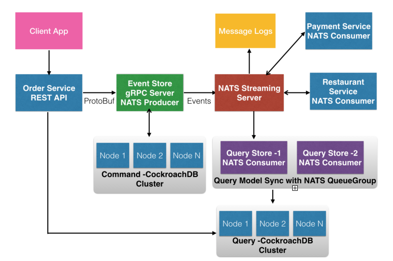
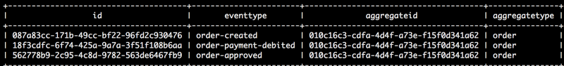

使用Golang语言建造EventSourcing/CQRS的微服务
=============

> 导读：

> 本文的主要目的是通过`EventSourcing`和`CQRS`来构建事件驱动的微服务。构建真实世界的微服务是非常复杂的，其中最困难的部分是处理分散在各个微服务拥有的几个数据库中的数据。这使得构建跨多个微服务的业务事务变得非常复杂，并且查询数据时对多个数据库无法进行关联查询。因此，您必须使用一些架构方法从现实世界的角度构建微服务，您可以考虑使用事件驱动的体系结构，如`EventSourcing`。`EventSourcing`架构最好与`CQRS`结合使用。虽然本文是基于`go`语言实现，但代码简单清晰，清楚的介绍了`EventSourcing`和`CQRS`如何结合使用，其它语言的工程师也可阅读，相信会有帮助。


在这篇文章中，我将演示`Go`中的一个简单的`EventSourcing/CQRS`示例，演示如何解决基于微服务的分布式系统的实际挑战。请记住，这篇文章的目的不是介绍EventSourcing和CQRS的最佳实践，而是通过在Go中编写一个简单的示例来介绍这两种架构和设计模式，它为构建基于微服务的分布式系统提供了解决方案，以便处理事务和数据。

### 微服务中最难的部分：数据和事务
----------

从未在分布式系统上工作的人一直误解微服务只能在`Docker`容器中运行服务并使用`Kubernetes`进行编排， 在我的国家，印度，很多人一直在提供关于微服务的企业培训和指导，有两个误解：微服务只是用`Kubernetes`编排容器，或者只是在`Netflix OSS`中使用`Spring Boot`框架。 但实际上，微服务是一种分布式系统架构模式，它完全用于构建高度可扩展和可演化的软件系统的功能分解。 简而言之，微服务是一种协同工作的小型自治服务。

#### 数据分散在微服务的多个数据库中
---------

分解微服务的一种常用做法是针对有界上下文来设计每个微服务，这是*领域驱动设计*`(DDD)`中的中心模式，通过将大的域模型划分为多个不同的逻辑域，将业务问题分解到各个子域的有界上下文中。单个有界上下文可以通过一个或多个聚合进行事务。因为我们通常针对每个有界上下文构建微服务，所以我们通常为每个微服务使用单独的数据库，每个微服务看起来像一个独立的系统。

因为我们将单体系统分解成几个自治服务，所以数据会分散在各个微服务所对应的几个数据库中。这使您的应用程序和体系结构变得非常复杂。 例如，业务事务可能跨越多个微服务。 假设您构建了一个带有微服务的电子商务系统，其中下订单最初将由一个微服务——`OrderService`处理，然后支付处理可能由另一个服务——`PaymentService`完成，依此类推。 另一个挑战是从多个数据库查询数据。 使用单体(`monolithic`)数据库，您可以轻松地从数据库中执行连接查询。 在微服务中，由于单体数据库作为功能组件被分解到多个数据库中，因此不能简单地执行连接查询，必须要从多个数据库中获取数据。

### 使用`EventSourcing`和`CQRS`构建事件驱动的微服务
----------

为了解决微服务的实际挑战，事件驱动的、反应式的系统在领域驱动设计中结合使用是一个很好的办法。因此，我强烈建议使用`EventSourcing`，这是以事件为中心的架构，通过编写各种事件来构建应用程序状态。

#### `EventSourcing`: 使用不可变日志记录事件变化的存储
----------

`EventSourcing`通过不可变的日志存储事件，其中每条日志（代表对某个对象的更改）表示应用程序的状态。事件存储就像版本控制系统，在微服务架构中，我们可以将聚合操作通过一系列的事件进行持久化存储，事件就是事实，代表系统中发生的一些行为。这些是不可变的，无法更改或撤销的。电子商务系统中的事件包括`OrderCreated`, `PaymentDebited`, `OrderApproved`, `OrderRejected`, `OrderShipped`, `OrderDelivered`等。

在您的`EventSourcing`架构中，当您从一个微服务中发布一个事件，其它微服务可以订阅这个事件并另一组事件。有时，可以将`EventSourcing`与Unix管道操作进行比较。 基于微服务的系统中的单个事务可以跨越多个微服务，其中我们可以通过一系列事件构建反应式微服务来执行事务。聚合操作的每个状态更改都可以视为事件，这是系统的不可变事实。

#### 使用`CQRS`构建聚合视图的查询模型
----------

当您使用`EventSourcing`将一系列事件进行持久化时，您可能需要一种架构方法来解决对微服务的查询，因为写模型(`Commands`)只是一个事件存储。一种新的架构——命令查询职责分离(`Command Query Responsibility Segregation，CQRS`)是实现微服务查询的理想模式。顾名思义，`CQRS`将应用程序划分为两个部分：执行更改聚合状态的操作的命令，以及为聚合视图提供查询模型的查询。虽然`CQRS`是一种独立的架构模式，但我们经常使用`EventSourcing`作为命令模型，我们也可以为写操作和查询操作提供不同的数据库。这还允许您通过将非规范化数据集加载到读取模型的数据存储中来创建高性能的查询模型。

### `Go`语言的`EventSourcing`和`CQRS`的示例——使用gRPC, NATS Streaming和CockroachDB等技术
----------

示例的代码可以在此处获得:[https://github.com/shijuvar/go-distributed-sys](https://github.com/shijuvar/go-distributed-sys)。

为了方便理解，我简化了概念并提供了一个示例，展示如何使用gRPC，NATS等技术构建分布式系统。

#### `NATS Streaming`用于消息传递
----------

在`EventSourcing`架构中，当您从一个微服务中发布一个事件时，其他微服务可以对这些事件做出反应，并在执行自己的本地事务后发布另一组事件。基于微服务的系统中的单个事务可以跨越多个微服务，其中我们可以通过一系列的事件来执行事务。每个聚合状态的更改都可以视为一系列的事件，这是关于系统的不可变事实。为了发布事件以让其他微服务知道系统中发生了某些事情，我们需要使用消息传递系统。在此示例中，我们使用`NATS Steraming Server`作为事件流系统来构建事件驱动的微服务。事件驱动的反应式架构是构建大规模可扩展微服务的架构方法的绝佳选择。如果您对`NATS`和`NATS Streaming`不熟悉，请查看我关于基本`NATS`的文章这里和`NATS Streaming` 在[这里](https://medium.com/@shijuvar/building-distributed-systems-and-microservices-in-go-with-nats-streaming-d8b4baa633a2)。我认为`NATS`是构建分布式系统的神经系统，我一直致力于Go生态系统。

#### `gRPC`用于构建`APIs`
----------

在示例中，事件存储提供了一个`API`去执行命令，这是一个基于`gRPC`的`API`。`gRPC`是一个高性能、开源的远程过程调用框架，可以在任何地方运行。它使`Client`和`Server`能够透明地进行通信，并使构建连接系统更加容易。`gRPC`被广泛称为微服务中的通信协议。如果您通过`API`在微服务之间进行通信，那么`gRPC`是很好地选择，如果您不了解`gRPC`，可以查看我的[文章](https://medium.com/@shijuvar/building-high-performance-apis-in-go-using-grpc-and-protocol-buffers-2eda5b80771b)。

#### 示例演示
----------

下图是示例代码的结构：


这是代码的架构图：



这是示例中的基本工作流程：

1. 客户端应用程序将订单发布到HTTP API。

2. 一个`HTTP API(OrderService)`接收的命令，然后使用`gRPC API`创建一个事件，通过一个命令将事件存储到`Event Store`，存储的是事件的不可变的日志。

3. `Event Store`通过`API`执行命令，然后向`NATS Streaming`服务器发布`order-created`事件，以便让其他服务知道创建了一个事件。

4. 付款服务（`PaymentService`）订阅事件`order-created`，然后进行付款，然后通过`Event Store API`创建另一个事件`order-payment-debited`。

5. 查询服务（orderquery-store1和orderquery-store2作为队列订阅者）也订阅了`order-created`事件，该事件同步数据模型以提供查询视图的聚合状态。

6. `Event Store API`在事件存储上执行命令以创建事件`order-payment-debited`，并向`NATS Streaming`服务器发布事件，以便让其他服务知道付款已被记入借方。

7. 餐厅服务（RestaurantService）最终批准订单。

8. `Distributed Saga`管理分布式事务并在失败时进行无效事务回滚（暂未实现）

#### `EventSourcing`的事件存储
-----------

这是消息`Event`的结构体定义。示例中的每个状态更改都被视为事件，并在`Event Store`中执行命令。


**清单1**. 消息的结构协议缓冲区中的事件:

```golang
message Event { 
    string event_id = 1; 
    string event_type = 2; 
    string aggregate_id = 3; 
    string aggregate_type = 4; 
    string event_data = 5; 
    string channel = 6; //一个可选字段
}
```

`Event Store`提供了一个`gRPC API`用于保存事件。这是`Event Store`实现中的基本代码块：

**清单2**. gRPC服务器中的基本实现:

```golang
// CreateEvent RPC creates a new Event into EventStore
// and publish an event to NATS Streaming
func (s *server) CreateEvent(ctx context.Context, in *pb.Event) (*pb.Response, error) {
   // Persist data into EventStore database
   command := store.EventStore{}
   // Persist events as immutable logs into CockroachDB
   err := command.CreateEvent(in)
   if err != nil {
      return nil, err
   }
   // Publish event on NATS Streaming Server
   go publishEvent(s.StreamingComponent, in, )
   return &pb.Response{IsSuccess: true}, nil
}

// publishEvent publishes an event via NATS Streaming server
func publishEvent(component *natsutil.StreamingComponent, event *pb.Event) {
   sc := component.NATS()
   channel := event.Channel
   eventMsg := []byte(event.EventData)
   // Publish message on subject (channel)
   sc.Publish(channel, eventMsg)
   log.Println("Published message on channel: " + channel)
}
```

每当新事件通过其`gRPC API`作为不可变日志持久化存储到`Event Store`中时，它就会通过`NATS Streaming`服务器发布事件，让其他微服务器知道新事件已发布，因此所有用户微服务都可以对这些事件做出反应。在此示例中，事件从`Event Store API`本身发布到消息传递系统(`NATS Streaming`)中。在实际场景中，它可能来自单个微服务，也可能来自协调单个业务事务跨越多个微服务的`Distributed Saga`。


#### 订阅用于构建反应式微服务的事件
---------

当您将事件持久存储到`Event Store`中时，它通过`NATS Streaming`发布新事件，如果您的微服务对这些事件感兴趣，则微服务可以对这些事件进行订阅。在这里，我们使用`NATS Streaming`订阅事件。在此示例中，当创建`order-created` 事件时，`PaymentService`订阅该事件，并创建另一个名为`order-payment-debited`的事件。

**清单3**. 对`order-created`事件做出反应的`NATS Streaming`订户客户端:

```golang
const (
   clusterID = "test-cluster"
   clientID  = "payment-service"
   subscribeChannel   = "order-created"
   durableID = "payment-service-durable"

   event     = "order-payment-debited"
   aggregate = "order"

   grpcUri   = "localhost:50051"
)

func main() {
   // Register new NATS component within the system.
   comp := natsutil.NewStreamingComponent(clientID)

   // Connect to NATS Streaming server
   err := comp.ConnectToNATSStreaming(
      clusterID,
      stan.NatsURL(stan.DefaultNatsURL),
   )
   if err != nil {
      log.Fatal(err)
   }
   // Get the NATS Streaming Connection
   sc := comp.NATS()
   // Subscribe with manual ack mode, and set AckWait to 60 seconds
   aw, _ := time.ParseDuration("60s")
   // Subscribe the channel
   sc.Subscribe(subscribeChannel, func(msg *stan.Msg) {
      msg.Ack() // Manual ACK
      order := pb.OrderCreateCommand{}
      // Unmarshal JSON that represents the Order data
      err := json.Unmarshal(msg.Data, &order)
      if err != nil {
         log.Print(err)
         return
      }
      // Create OrderPaymentDebitedCommand from Order
      command := pb.OrderPaymentDebitedCommand {
         OrderId: order.OrderId,
         CustomerId: order.CustomerId,
         Amount: order.Amount,
      }
      log.Println("Payment has been debited from customer account for Order:", order.OrderId)
      if err:= createPaymentDebitedCommand(command); err!=nil {
         log.Println("error occured while executing the PaymentDebited command")
      }
   }, stan.DurableName(durableID),
      stan.MaxInflight(25),
      stan.SetManualAckMode(),
      stan.AckWait(aw),
   )
   runtime.Goexit()
}
```

#### 订阅事件以构建聚合视图的查询模型
--------

在`CQRS`中，它将应用程序分为两部分：命令和查询。这里的命令是使用`EventSourcing`实现的，`EventSourcing`使用不可变事件日志的`Event Store`来构建应用程序状态。为了创建查询模型，我们还可以在执行命令操作时订阅事件。在这个例子中，服务`orderquery-store 1`和`orderquery-store2`通过`QueueGroup`订阅，通过`NATS Streaming`订阅事件`order-created`。`NATS`中的`QueueGroup`订阅服务允许您在不进行任何配置的情况下实现负载均衡。

**清单4**. 用于同步查询模型的`NATS Streaming QueueGroup`订户客户端:

```golang
const (
   clusterID  = "test-cluster"
   clientID   = "order-query-store1"
   channel    = "order-created"
   durableID  = "store-durable"
   queueGroup = "order-query-store-group"
)

func main() {
   // Register new component within the system.
   comp := natsutil.NewStreamingComponent(clientID)

   // Connect to NATS Streaming server
   err := comp.ConnectToNATSStreaming(
      clusterID,
      stan.NatsURL(stan.DefaultNatsURL),
   )
   if err != nil {
      log.Fatal(err)
   }
   // Get the NATS Streaming Connection
   sc := comp.NATS()
   sc.QueueSubscribe(channel, queueGroup, func(msg *stan.Msg) {
      order := pb.OrderCreateCommand{}
      err := json.Unmarshal(msg.Data, &order)
      if err == nil {
         // Handle the message
         log.Printf("Subscribed message from clientID - %s: %+v\n", clientID, order)
         queryStore := store.QueryStore{}
         // Perform data replication for query model into CockroachDB
         err := queryStore.SyncOrderQueryModel(order)
         if err != nil {
            log.Printf("Error while replicating the query model %+v", err)
         }
      }
   }, stan.DurableName(durableID),
   )
   runtime.Goexit()
}
```

这里，每当发布`order-created`事件时，订阅者根据事件执行一些逻辑并进行数据同步，通过将数据保存到数据存储中来创建聚合的非规范化视图，它用于CQRS架构中的查询模型。

#### 使用`CockroachDB`持久存储
---------

使用`CQRS`的一个主要好处是，您可以为写入操作和查询操作使用不同的数据模型，因此您还可以使用不同的数据库技术。在此示例演示中，我们使用`CockroachDB`执行命令和查询模型。`CockroachDB`是一个分布式数据库，用于构建可在灾难中恢复的全球可扩展云服务。在`Go`应用程序中，您可以使用类似于`PostgreSQL`的驱动程序（如`github.com/lib/pq`）来处理`SQL` 。如果您正在使用`package database/sql`进行事务，请使用`CockroachDB`的官方库`github.com/cockroachdb/cockroach-go/crdb`。在示例演示中，使用CockroachDB的持久性逻辑在代码的`store`包中实现。g官方包`crdb`的方法`ExecuteTx`可以帮助您将事务执行到`CockroachDB`中。

**清单5**. 使用包`crdb`在`CockroachDB`中的事务实现:

```golang
func (store QueryStore) SyncOrderQueryModel(order pb.OrderCreateCommand) error {

   // Run a transaction to sync the query model.
   err := crdb.ExecuteTx(context.Background(), db, nil, func(tx *sql.Tx) error {
      return createOrderQueryModel(tx, order)
   })
   if err != nil {
      return errors.Wrap(err, "Error on syncing query store")
   }
   return nil
}

func createOrderQueryModel(tx *sql.Tx, order pb.OrderCreateCommand) error {
   // Execute transactions here
return nil
}
```

这是`Event Store`的不可变日志，用于创建最终的订单:



`Event Store`的事件表有一个名为`eventdata`的字段，我们将整个事件数据作为`JSON`文档保存到该字段，它对构建应用程序状态以及构建查询视图很有用。

### 源代码
---------

示例演示的源代码可在此处获得：[https://github.com/shijuvar/go-distributed-sys](https://github.com/shijuvar/go-distributed-sys)


### 总结
---------

本文的主要目的是通过`EventSourcing`和`CQRS`来构建事件驱动的微服务。构建真实世界的微服务是非常复杂的，其中最困难的部分是处理分散在各个微服务拥有的几个数据库中的数据。这使得构建跨多个微服务的业务事务变得非常复杂，并且查询数据时对多个数据库无法进行关联查询。因此，您必须使用一些架构方法从现实世界的角度构建微服务，您可以考虑使用事件驱动的体系结构，如`EventSourcing`。`EventSourcing`架构最好与`CQRS`结合使用。
